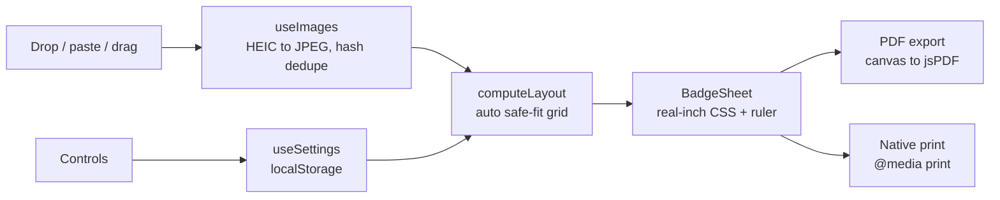

# Badges

Turn your photos into print-ready badge, button, and sticker sheets - drop images, auto-fit a grid, export a print-ready PDF. Everything runs in your browser; nothing is ever uploaded.


[](LICENSE)


**Live:** https://badges-bheng.vercel.app

## Contents

- [Features](#features)
- [Architecture](#architecture)
- [How it works](#how-it-works)
- [Tech stack](#tech-stack)
- [Quick start](#quick-start)
- [Configuration](#configuration)
- [Project layout](#project-layout)
- [License](#license)

## Features

- **iPhone HEIC/HEVC support** - drop photos straight from an iPhone; they are decoded in-browser via libheif WebAssembly (no upload)
- **Drop / paste (⌘V) / drag anywhere** to add images, with a live "N images incoming" overlay
- **Two real badge sizes** - Small (4.75 cm / 1.87") and Large (6.8 cm / 2.68") diameters
- **Auto-fit layout** - packs the most badges per page inside a safe printable border (no manual columns/gaps)
- **Square or circle** shapes; plain, kids, or neon styles
- **Drag a badge to reframe** its focal point so faces are never cropped out
- **Drag to reorder** across pages; **duplicate photos are skipped** by content hash
- **True-size ruler & 1-unit grid** (click to toggle inches/cm) plus black cut guides
- **Light table** - overlay the front sheet with the flipped back sheet and see the double-sided line-up as colour fringes, with a printer-drift slider to compare against what a real duplex printer does
- **Export** - an email-friendly, print-DPI PDF drawn per badge (size-prefixed filename), or native print
- **Privacy-first** - all processing happens in the browser; no server, no upload


## Architecture

A single-page client app. Images become in-browser object URLs (HEIC converted
first); a pure layout module auto-computes the safe-fit grid and paginates; the
preview renders each page as a real-inch CSS sheet, and export draws each badge
straight to a canvas placed at exact inch coordinates in the PDF.



| Layer | Responsibility | Key files |
| --- | --- | --- |
| Layout math | Auto safe margin, fit + paginate | `lib/layout.ts`, `lib/presets.ts` |
| State | Images (HEIC + dedupe), settings | `lib/useImages.ts`, `lib/useSettings.ts` |
| UI | Landing, controls, tray, sheet | `components/*` |
| Export | Draw each badge to a PDF page | `lib/pdf.ts` |

## How it works

`autoSafeMargin` finds the most generous margin (at least a printer-safe minimum)
that still fits the maximum badges, so the grid centers with an even safe border.
`computeLayout` then derives the columns and rows that fit the chosen diameter,
and `buildPages` flows the photos across pages. Each page renders as a `.sheet`
sized in real inches (so `@media print` prints at true size), and the PDF exporter
draws every badge onto a canvas - cropped to its shape with its focal offset - and
places it at exact inch coordinates, keeping the file email-friendly and sharp.

## Checking the double-sided line-up

Two independent checks, because "it looks fine" is not proof.

**In the app** - turn on Double-sided, then hit **Light table**. The front sheet is
drawn in red, the back sheet is flipped over and laid on top in cyan, and where
they agree you get flat dark badges. Any red or cyan fringe *is* the offset. The
photos are deliberately left out of this view: the export does not mirror artwork
(that is the point - a face reads correctly on both sides), so once the back sheet
is flipped its photos no longer match and only the shape can honestly be compared.
Drag **Printer drift** to see what 0.5mm or 1mm of real printer misregistration
would look like next to the file's own zero.

**On the exported file** - run the light table over the PDF itself:

```bash
npm run check:duplex -- ~/Desktop/badges.pdf
```

It renders the real pages with poppler, correlates every badge against the back
page, and reports the measured offset in pixels and millimetres, plus a proof PNG
per sheet. It measures the file you are about to send, so it works on an old
export too.

How it measures matters. The cut guides are symmetric about the page centre, so
mirroring maps them onto themselves - they look identical whether the mirror is
right, wrong, or missing entirely, and prove nothing. Instead each cell's
*unflipped* artwork is correlated against the back page: the same photo is drawn
on both sides, so the match is near-exact and the peak says where the back badge
actually sits, to a fraction of a pixel, trusting none of the layout code.

Sub-pixel residue is JPEG noise, not a shift - a real error shows up as a whole
pixel with the same sign on every badge. For scale: 1px at 240 DPI is 0.106mm,
while a consumer duplex printer's front-to-back registration is typically off by
0.5-1.5mm. The file is the precise part; the printer is not.

**Print with: Actual size / 100% scale (never "Fit to page" or "Shrink oversized
pages"), two-sided, flip on LONG edge.**

## Tech stack

- [Next.js 16](https://nextjs.org) (App Router) + React 19 + TypeScript (strict)
- Tailwind CSS v4
- [heic-to](https://github.com/hoppergee/heic-to) (libheif WebAssembly) for iPhone HEIC
- [jsPDF](https://github.com/parallax/jsPDF) + HTML5 Canvas for the PDF export
- `next/og` for the generated favicon, apple-touch icon, and OG share image
- Vitest + Testing Library
- Deployed on Vercel

## Quick start

```bash
git clone https://github.com/bunlongheng/badges.git
cd badges
npm install
npm run dev
```

Open http://localhost:3007 and drop in some photos (or click "try an example").

### Scripts

| Command | Description |
| --- | --- |
| `npm run dev` | Start the dev server |
| `npm run build` | Production build |
| `npm start` | Serve the production build |
| `npm test` | Run the unit + component tests |
| `npm run check:duplex -- <file.pdf>` | Measure a double-sided export's front/back line-up |
| `npm run typecheck` | TypeScript type-check |
| `npm run lint` | ESLint |

## Configuration

No environment variables required. The app is fully client-side and stores your
grid settings in `localStorage`.

## Project layout

```
app/                 # App Router: landing, sign-in, icons, manifest, OG image
  page.tsx           # the studio (landing, controls, live preview, export)
  signin/            # branded local-first welcome page
  icon.png           # favicon  ·  apple-icon.png  ·  manifest.ts  ·  opengraph-image.tsx
components/           # Aurora, DropZone, Controls, ImageTray, BadgeSheet, Header
lib/                  # layout math, presets, PDF export, hooks (images/settings)
public/samples/       # bundled example photos ("try an example")
test/                 # Vitest unit + component tests
reference/            # the original standalone HTML prototypes (source material)
docs/screenshots/     # README images
```

## License

[MIT](LICENSE) (c) Bunlong Heng
