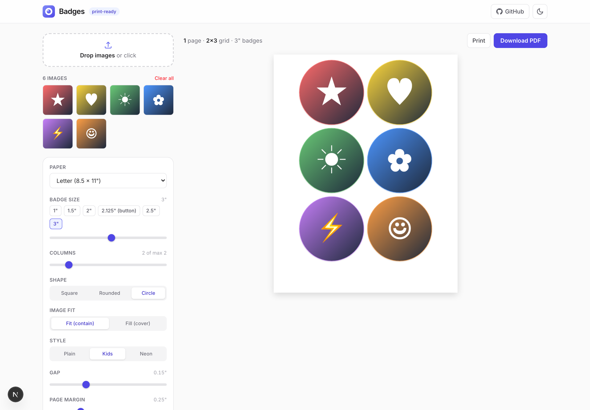
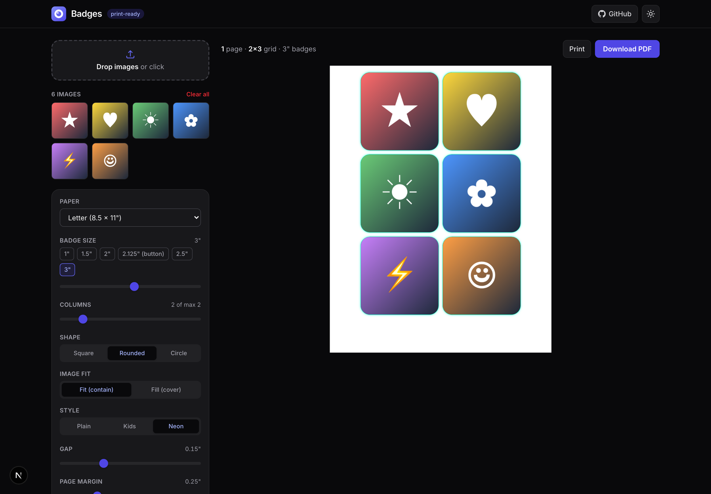
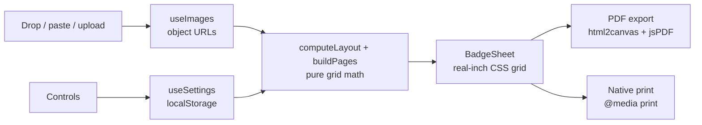

# Badges

Turn any images into print-ready badge, button, and sticker sheets - drop, size, export a PDF. Everything runs in your browser; nothing is ever uploaded.


[](LICENSE)


**Live:** https://badges-bheng.vercel.app

## Contents

- [Features](#features)
- [Architecture](#architecture)
- [How it works](#how-it-works)
- [Tech stack](#tech-stack)
- [Quick start](#quick-start)
- [Configuration](#configuration)
- [Project layout](#project-layout)
- [License](#license)

## Features

- **Drop, paste (⌘V), or upload** any number of images
- **Size presets** - 1", 1.5", 2", 2.125" (classic button), 2.5", 3", plus a custom slider
- **Shapes** - square, rounded, or circle overlay
- **Styles** - plain, kids (colorful frames), or neon
- **Grid control** - columns, gap, and page margin, with automatic row fitting
- **Paper sizes** - US Letter, A4, Legal
- **Repeat-to-fill** a page from a few images (print multiple copies at once)
- **Cut guides** for trimming
- **Export** - high-resolution PDF or native browser print at true size
- **Reorder / remove** individual images
- **Light & dark mode**, with settings persisted locally
- **Privacy-first** - all processing happens in the browser, no server, no upload

|  |  |
| --- | --- |
|  |  |

## Architecture

A single-page client app. Images become in-browser object URLs; a pure layout
module computes the grid and paginates; the preview renders each page as a
real-inch CSS sheet that is either rasterized into a PDF or sent to the printer.



| Layer | Responsibility | Key files |
| --- | --- | --- |
| Layout math | Fit badges to paper, paginate | `lib/layout.ts`, `lib/presets.ts` |
| State | Images + persisted settings + theme | `lib/useImages.ts`, `lib/useSettings.ts`, `lib/useTheme.ts` |
| UI | Drop zone, controls, image tray, sheet | `components/*` |
| Export | Rasterize sheets to a PDF | `lib/pdf.ts` |
| App shell | Routing, metadata, icons, OG, manifest | `app/*` |

## How it works

`computeLayout` derives how many badges fit across and down a chosen paper size
given the badge size, gap, and margin, clamping the column count to what
physically fits. `buildPages` then flows the images across pages (or tiles them
to fill one page in repeat mode). Each page renders as a `.sheet` sized in real
inches, so `@media print` prints at true size and the PDF exporter can rasterize
each page at ~240 DPI onto a matching PDF page.

## Tech stack

- [Next.js 16](https://nextjs.org) (App Router) + React 19 + TypeScript (strict)
- Tailwind CSS v4
- [jsPDF](https://github.com/parallax/jsPDF) + [html2canvas](https://html2canvas.hertzen.com) for PDF export
- `next/og` for generated icons, apple-touch icon, and the OG share image
- Vitest + Testing Library
- Deployed on Vercel

## Quick start

```bash
git clone https://github.com/bunlongheng/badges.git
cd badges
npm install
npm run dev
```

Open http://localhost:3007 and drop in some images.

### Scripts

| Command | Description |
| --- | --- |
| `npm run dev` | Start the dev server (port 3007) |
| `npm run build` | Production build |
| `npm start` | Serve the production build |
| `npm test` | Run the unit + component tests |
| `npm run typecheck` | TypeScript type-check |
| `npm run lint` | ESLint |

## Configuration

No environment variables required. The app is fully client-side and stores your
grid settings in `localStorage`.

## Project layout

```
app/                 # App Router: layout, home, sign-in, icons, manifest, OG image
  page.tsx           # the studio (drop zone, controls, live preview)
  signin/            # branded local-first welcome page
  icon.tsx           # generated PWA icons (192 + 512)
  apple-icon.tsx     # generated apple-touch icon
  opengraph-image.tsx# generated social share image
  manifest.ts        # PWA / add-to-home-screen manifest
components/           # DropZone, Controls, ImageTray, BadgeSheet, Header, ...
lib/                  # layout math, presets, PDF export, hooks
test/                 # Vitest unit + component tests
reference/            # the original standalone HTML prototypes (source material)
docs/screenshots/     # README images
```

## License

[MIT](LICENSE) (c) Bunlong Heng
